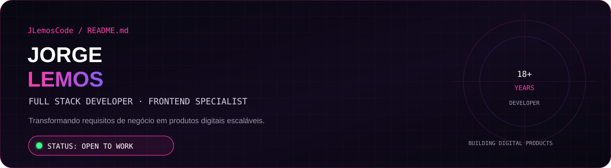
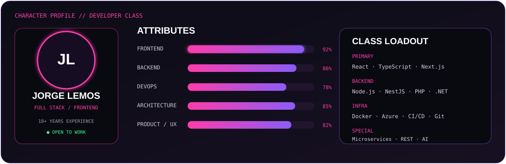
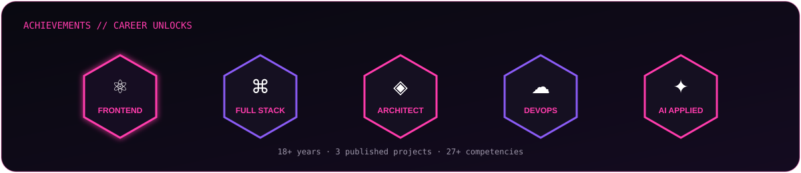

<div align="center">

</div>
<br>
<div align="center">
<a href="https://portfolio.jlemos.digital/">
  
</a>
<a href="https://www.linkedin.com/in/lemosjorge">
  
</a>
<a href="https://github.com/JLemosCode">
  
</a>
<a href="mailto:jlemos.digital@gmail.com">
  
</a>
</div>
---
<div align="center">

</div>
⚔️ QUEST LOG
> O objetivo não é escrever mais código. É transformar requisitos de negócio em soluções técnicas eficientes, escaláveis e sustentáveis.
Status	Quest	Resultado
🟢	Frontend & UI	Interfaces modernas, responsivas e com microinterações
🟢	Full Stack	Do layout ao deploy, conectando as camadas
🟢	Architecture	Microsserviços, APIs REST e sistemas escaláveis
🟢	Integrations	ERP, CRM, pagamentos e serviços de terceiros
🟢	AI Applied	Recursos de IA integrados a produtos reais
🔥	Open to Work	Projetos e oportunidades
---
<div align="center">

</div>
🎮 RECENT PROJECTS
O portfólio atual destaca PUBG BattleHub, Marketplace e AvaliadIN como projetos recentes.
<div align="center">
<a href="https://portfolio.jlemos.digital/">
  
</a>
<a href="https://portfolio.jlemos.digital/">
  
</a>
<a href="https://portfolio.jlemos.digital/">
  
</a>
</div>
---
🧠 PROFILE
Desenvolvedor Full Stack especializado em sistemas web escaláveis, SaaS, ERP e arquiteturas baseadas em microsserviços. Foco em performance, integração de sistemas e entrega de produtos robustos em produção, atuando do frontend ao backend.
Career
Atual — JL Lemos Digital LTDA — Desenvolvedor Full Stack | Especialista em Frontend.
2018 — 2023 — Ratto Software — Desenvolvedor Full Stack Sênior | Team Leader.
2017 — 2018 — Prosolution Consultoria — Analista de Sistemas, com atuação em integração e evolução de sistemas para Juntas Comerciais de RJ, BA e SC.
---
<div align="center">

</div>
📊 GITHUB TELEMETRY
<div align="center">

</div>
---
🧬 ENGINEERING PRINCIPLES
```text
01  Understand the problem
02  Model the domain
03  Design the architecture
04  Build the smallest useful solution
05  Test, observe and iterate
06  Keep the code clean and maintainable
```
---
💬 WHAT I BRING
Performance-oriented development
Clean and maintainable code
Continuous learning
Full Stack ownership
Product thinking
Architecture and integrations
Esses pontos refletem o posicionamento apresentado no meu portfólio.
---
<div align="center">
`READY FOR THE NEXT QUEST?`
<a href="https://portfolio.jlemos.digital/">
  
</a>
<a href="mailto:jlemos.digital@gmail.com">
  
</a>
<br><br>
<sub>Developer Leveling System · Generated from GitHub activity · JLemosCode</sub>
</div>
