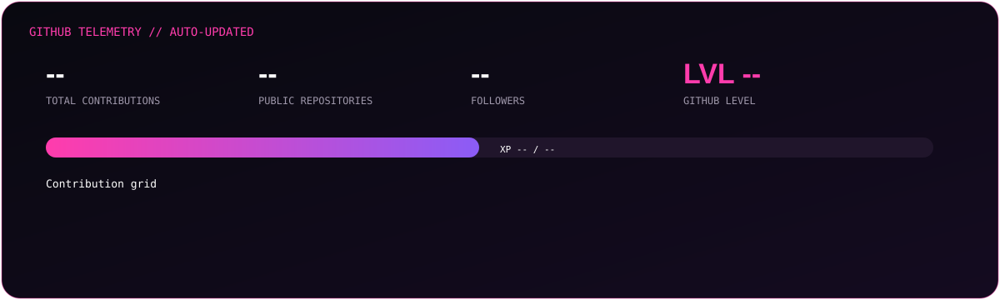
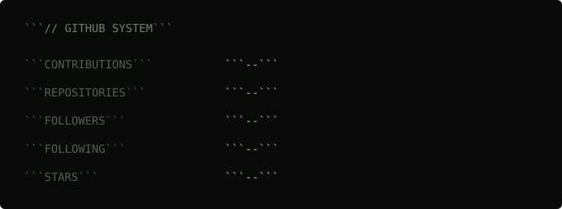

<div align="center">



</div>

<br>

<table width="100%">
<tr>

<td width="50%" valign="top">

## `// SYSTEM STATUS`

```text
┌──────────────────────────────────────┐
│                                      │
│  STATUS       : ONLINE               │
│  DEVELOPER    : Jorge Lemos          │
│  ROLE         : Full Stack Developer │
│  FOCUS        : Frontend / Backend   │
│  LOCATION     : Brazil               │
│                                      │
└──────────────────────────────────────┘
```

</td>

<td width="50%" valign="top">

## `// CONNECT`

```text
┌──────────────────────────────────────┐
│                                      │
│  GITHUB                              │
│  github.com/JLemosCode               │
│                                      │
│  LINKEDIN                            │
│  linkedin.com/in/SEU-USUARIO         │
│                                      │
│  PORTFOLIO                           │
│  seu-portfolio.com                   │
│                                      │
└──────────────────────────────────────┘
```

</td>

</tr>
</table>

---

## `// PROFILE`

```text
┌──────────────────────────────────────────────────────────────────────────────┐
│                                                                              │
│  JORGE LEMOS                                                                 │
│  FULL STACK DEVELOPER / FRONTEND SPECIALIST                                 │
│                                                                              │
│  Transformando ideias em produtos digitais.                                 │
│                                                                              │
│  Experiência em desenvolvimento de aplicações web,                          │
│  integrações, APIs, arquitetura e soluções digitais.                        │
│                                                                              │
│  Foco em código limpo, experiência do usuário                               │
│  e soluções que resolvem problemas reais.                                   │
│                                                                              │
└──────────────────────────────────────────────────────────────────────────────┘
```

---

<table width="100%">
<tr>

<td width="33%" valign="top">

## `// TECH STACK`

### `FRONTEND`

```text
> React
> TypeScript
> JavaScript
> Angular
> HTML / CSS
> Bootstrap
> Razor
```

### `BACKEND`

```text
> Node.js
> PHP
> .NET
> C#
> Python
> Java
```

### `DATABASE`

```text
> MySQL
> SQL
> MongoDB
> SQL Server
```

### `DEVOPS`

```text
> Docker
> Git
> GitHub Actions
> Azure
> CI/CD
```

### `ENGINEERING`

```text
> REST APIs
> Clean Architecture
> SOLID
> DDD
> TDD
> BPM
> Microservices
```

</td>

<td width="34%" valign="top">

## `// EXPERIENCE`

```text
● SOFTWARE DEVELOPMENT

  Full Stack Development

  ├─ Frontend
  ├─ Backend
  ├─ APIs
  ├─ Integrations
  └─ Architecture
```

```text
● INFRASTRUCTURE

  Systems & Infrastructure

  ├─ Servers
  ├─ Networks
  ├─ Security
  └─ Automation
```

```text
● CURRENT FOCUS

  ├─ React
  ├─ Node.js
  ├─ TypeScript
  ├─ PHP
  ├─ Docker
  ├─ AI / Automation
  └─ Product Development
```

```text
> From infrastructure
> to software engineering.
```

</td>

<td width="33%" valign="top">

## `// PROJECTS`

### `> PUBG BATTLEHUB`

```text
Competitive gaming
platform.

React
Node.js
MongoDB
APIs
```

---

### `> DIGITAL PRODUCTS`

```text
Web applications
and business platforms.

React
Node.js
PHP
.NET
SQL
```

---

### `> AUTOMATION`

```text
Systems integration
and process automation.

APIs
Docker
BPM
CI/CD
```

```text
> MORE PROJECTS

github.com/JLemosCode
```

</td>

</tr>
</table>

---



---

## `// GITHUB ACTIVITY`

<table width="100%">
<tr>

<td width="40%" valign="top">

```text
┌─────────────────────────────┐
│                             │
│  CONTRIBUTIONS   : LIVE     │
│  REPOSITORIES    : LIVE     │
│  FOLLOWERS       : LIVE     │
│  FOLLOWING       : LIVE     │
│  STARS           : LIVE     │
│                             │
└─────────────────────────────┘
```

</td>

<td width="60%" valign="top">


</td>

</tr>
</table>

---

## `// CURRENTLY`

```text
> Building digital products

> Exploring AI and automation

> Improving developer experience

> Designing better interfaces

> Solving real world problems

> Learning. Building. Shipping.
```

---

<div align="center">



<br><br>

```text
JLemosCode@github:~$ exit

Connection closed.

Thanks for visiting! ★
```

<br>

<sub>
JLemosCode // Developer Terminal // GitHub Profile
</sub>

</div>
