<div align="center">


</div>

<br>

<div align="center">

<a href="https://portfolio.jlemos.digital/"></a>
&nbsp;
<a href="https://github.com/JLemosCode"></a>
&nbsp;
<a href="https://www.linkedin.com/"></a>

</div>

<br>

<div align="center">


</div>

## `01 / PROFILE`

```text
╭──────────────────────────────────────────────────────────────────────╮
│ JORGE LEMOS                                                        │
│ FULL STACK DEVELOPER                                                │
│                                                                      │
│ 18+ YEARS OF BUILDING SOFTWARE                                      │
│ Frontend • Backend • Architecture • Integrations • Product          │
╰──────────────────────────────────────────────────────────────────────╯
```

I build web products from interface to infrastructure, with a strong focus on **frontend, full-stack development, APIs, integrations, architecture and maintainable software**.

The current portfolio highlights projects such as **PUBG BattleHub, Marketplace and AvaliadIN**.

---

<div align="center">


</div>

## `02 / STACK DATABASE`

No fake percentages. No skill bars.

The stack is presented as a **retro terminal inventory**, grouped by the role each technology plays.

<div align="center">


</div>

---

## `03 / QUESTS`

```text
[COMPLETED]

  ✓ Build and maintain production web systems
  ✓ Work across frontend and backend
  ✓ Design and consume REST APIs
  ✓ Integrate external platforms and services
  ✓ Work with relational and NoSQL databases
  ✓ Containerize applications with Docker
  ✓ Lead and collaborate on software delivery

[CURRENT]

  → Keep evolving modern frontend architecture
  → Explore practical AI integrations
  → Build products with better UX and stronger engineering
```

---

<div align="center">



</div>

---

## `04 / ENGINEERING MODE`

```text
$ cat /etc/developer.conf

MODE        = PRODUCT + ENGINEERING
PRIORITY    = SOLVE_THE_PROBLEM
STYLE       = CLEAN / PRAGMATIC / MAINTAINABLE
FRONTEND    = REACT / TYPESCRIPT
BACKEND     = NODE / PHP / .NET
DATA        = SQL / MONGODB
INFRA       = DOCKER / AZURE
DESIGN      = UX / PROTOTYPING
VERSIONING  = GIT
```

---

<div align="center">


</div>

## `05 / CONTACT`

```text
┌─────────────────────────────────────────────────────────────┐
│  SYSTEM MESSAGE                                            │
│                                                             │
│  Looking for a developer who can understand the product,   │
│  work across the stack and turn requirements into software? │
│                                                             │
│  > open portfolio                                           │
└─────────────────────────────────────────────────────────────┘
```

<div align="center">

<a href="https://portfolio.jlemos.digital/">

</a>

<br><br>

<sub>JLemosCode // Developer Terminal // GitHub Profile</sub>

</div>
